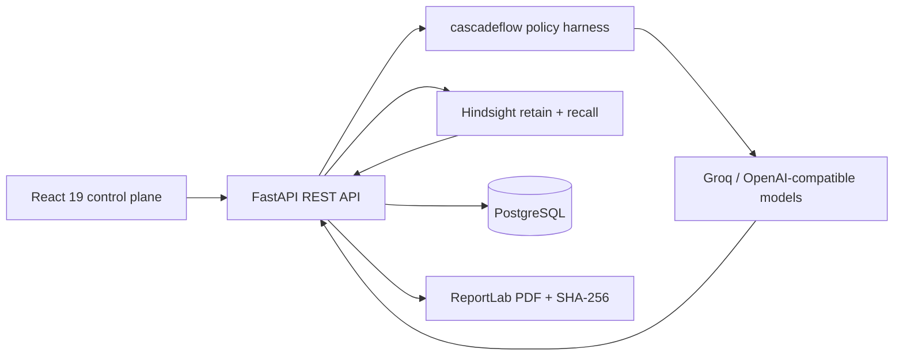

# AI Guardian

**Enterprise decision-intelligence control plane for explaining, remembering, and governing AI outcomes.**

Organizations increasingly use AI to make critical decisions in loan approvals, hiring, insurance claims, healthcare diagnosis, and university admissions. However, they struggle to answer crucial questions regarding transparency, bias, version drift, and historical precedent. 

**AI Guardian** solves these problems by providing explainability, auditability, long-term memory, and intelligent runtime routing. It is built as a modern enterprise SaaS platform designed for high-stakes, regulated environments.

Watch the complete demo of **AI Guardian – Intelligent AI Decision Audit Agent** here:

[](https://drive.google.com/file/d/1PkUugKewtlePpL2yZTslEeO08uT0Rvxc/view?usp=sharing)

---

## Core Technologies

AI Guardian is built around two central technologies:

1. **cascadeflow (Runtime Intelligence)**
   - Automatic model routing based on decision complexity.
   - Strict budget and latency enforcement.
   - Immutable audit trail of every routing decision.
2. **Hindsight (Persistent Memory)**
   - Long-term audit memory retention.
   - Similar case retrieval via multi-strategy search.
   - Continuous learning from auditor feedback.

---

## Application Modules

AI Guardian is composed of ten comprehensive modules designed for end-to-end AI governance:

1. **Authentication & Security**: Secure JWT login, signup, role-based access control (RBAC), password reset, and rigorous rate-limiting.
2. **Enterprise Dashboard**: Analytical cards, charts, statistics, recent activity feeds, cost analytics, and memory growth tracking.
3. **Decision Ingestion**: Upload engine supporting CSV, Excel (XLSX), and JSON formats with automatic data parsing.
4. **AI Explanation**: Dual-layered explainability. Generates both a plain-language summary and a technical risk/feature contribution analysis.
5. **Similar Case Search (Hindsight)**: Semantically searches historical decisions, returning similarity scores, previous outcomes, and past recommendations.
6. **Bias Detection**: Scans decisions against protected cohorts (Gender, Age, Region, Income) and generates severity-based fairness reports.
7. **Model Drift Detection**: Compares multiple model versions to track approval rate shifts and alert on outcome drift.
8. **Runtime Intelligence (cascadeflow)**: Routes simple queries to small models, medium queries to versatile models, and complex compliance queries to large models.
9. **Verifiable Audit Reports**: Generates downloadable PDF reports complete with applicant details, explanations, bias findings, routing costs, and SHA-256 cryptographic checksums.
10. **Analytics**: Deep portfolio intelligence including approval/rejection rates, model comparisons, bias trends, and audit timelines.

---

## Technology Stack

**Frontend**
- **Framework**: React 19, Vite, TypeScript
- **Styling**: Tailwind CSS 4 (Glassmorphism, Dark Mode, Modern Typography)
- **Animations**: Framer Motion
- **Data Visualization**: Chart.js, react-chartjs-2
- **Icons**: Lucide React
- **Routing & Forms**: React Router DOM, React Hook Form

**Backend**
- **Framework**: FastAPI (Python 3.11+), Uvicorn
- **Database**: PostgreSQL (Production), SQLite (Local Development)
- **ORM**: SQLAlchemy 2.0
- **Validation**: Pydantic, pydantic-settings
- **Auth & Security**: python-jose (JWT), passlib (bcrypt), CORS middleware
- **File Parsing**: openpyxl, built-in csv/json handlers
- **PDF Generation**: ReportLab
- **AI Integrations**: Groq API, Hindsight Client, cascadeflow

---

## Architecture & Workflow

1. User uploads a decision file.
2. Decision parser structures the data.
3. **cascadeflow** evaluates the complexity and budget.
4. **cascadeflow** routes the request to the optimal LLM (Small/Medium/Large).
5. The LLM generates the technical and plain-language explanation.
6. **Hindsight** searches institutional memory for similar past cases.
7. Bias and model drift analyses are performed.
8. The full audit report is generated as a secure PDF.
9. Everything is stored persistently in the database and Hindsight memory bank.
10. Dashboard analytics are updated in real-time.



---

## Database Design

The application uses a highly normalized relational database schema:
- `users`: Authentication and roles
- `audits`: Core decision records, scores, and recommendations
- `models` / `model_versions`: Track AI models and drift metrics
- `audit_reports`: PDF checksums and provenance
- `feedback`: Auditor corrections and ratings
- `memory_logs`: Telemetry for Hindsight retention and recall
- `bias_logs`: Tracked disparate impact findings
- `routing_logs`: Immutable ledger of every cascadeflow routing decision
- `cost_logs`: Token and USD cost tracking
- `settings` / `notifications`: User preferences and alerts

---

## Security Posture

- **Authentication**: JWT-based with secure headers.
- **Transport**: HTTPS-ready.
- **Protection**: SQL Injection protection (via SQLAlchemy ORM), XSS/CSRF mitigation.
- **Validation**: Strict Pydantic input validation on all endpoints.
- **Rate Limiting**: Custom deque-based sliding window rate limiting (120 req/min).
- **File Security**: Bounded uploads (max 10MB) with strict MIME type checking.

---

## Local Setup & Deployment

### 1. Backend API

```bash
cd backend
python -m venv .venv

# Activate virtual environment
# Windows: .venv\Scripts\Activate.ps1
# macOS/Linux: source .venv/bin/activate

pip install -r requirements.txt
cp .env.example .env
uvicorn app.main:app --reload
```

*API Documentation available at `http://localhost:8000/docs`.*  
*Demo credentials: `auditor@aiguardian.dev` / `Guardian123!`*

### 2. Frontend Web App

```bash
cd frontend
npm install
npm run dev
```

*Open `http://localhost:5173` in your browser.*

### Deployment
- **Frontend**: Deploy to Vercel (set `VITE_API_URL`).
- **Backend**: Deploy to Render or Railway using the included `Dockerfile` and `render.yaml`. Attach a PostgreSQL instance and set environment variables.

---

## Additional Documentation

- [Architecture Guide](docs/ARCHITECTURE.md)
- [API Reference](docs/API.md)
- [Deployment Guide](docs/DEPLOYMENT.md)
- [Contributing Guide](CONTRIBUTING.md)

## License

This project is licensed under the MIT License - see the [LICENSE](LICENSE) file for details.
