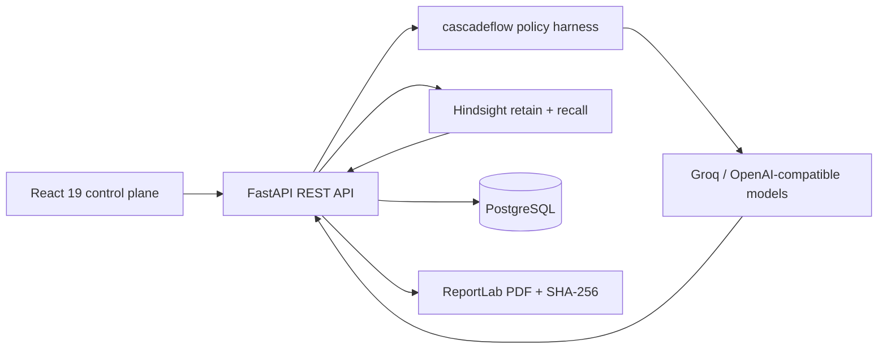

# AI Guardian

Enterprise decision-intelligence control plane for explaining, remembering, and governing AI outcomes.

AI Guardian is not a chatbot. It is an auditable workflow for high-stakes decisions: upload a source decision, route the explanation under cost and compliance constraints, retrieve relevant institutional history, inspect protected-cohort risk, compare model drift, and issue a verifiable PDF report.

## Architecture



The app runs in **demo-safe mode** without AI credentials. Explanations use a deterministic policy adapter, memory falls back to indexed audit records, and all telemetry is still written. Add Hindsight and Groq keys to enable the cloud paths.

## Features

- JWT authentication, role field, secure headers, rate limiting, validation, and bounded uploads
- CSV, JSON, and XLSX ingestion
- Plain-language and technical decision explanations
- Hindsight Cloud `retain` / `recall`, plus feedback retention
- cascadeflow budget-aware small / medium / large model selection and immutable routing ledger
- Protected-attribute fairness scans and model-version drift comparison
- Portfolio analytics for outcomes, cost, latency, model use, and memory growth
- Downloadable audit PDFs with provenance and SHA-256 checksums
- Responsive light/dark enterprise interface

## Local setup

### API

```powershell
cd backend
python -m venv .venv
.venv\Scripts\Activate.ps1
pip install -r requirements.txt
Copy-Item .env.example .env
uvicorn app.main:app --reload
```

API docs: `http://localhost:8000/docs`. Demo login: `auditor@aiguardian.dev` / `Guardian123!`.

### Web app

```powershell
cd frontend
npm install
Copy-Item .env.example .env
npm run dev
```

Open `http://localhost:5173`.

## Environment

| Variable | Purpose |
|---|---|
| `DATABASE_URL` | PostgreSQL URL in production; SQLite works locally |
| `SECRET_KEY` | JWT signing secret; generate a long random production value |
| `GROQ_API_KEY` | Enables live OpenAI-compatible inference |
| `GROQ_BASE_URL` | Provider base URL |
| `HINDSIGHT_API_KEY` | Enables Hindsight Cloud memory |
| `HINDSIGHT_BANK_ID` | Dedicated enterprise memory bank |
| `CORS_ORIGINS` | Comma-separated trusted web origins |

## Tests

```powershell
cd backend; pytest
cd ../frontend; npm run build
```

## Deployment

- Frontend: import `frontend` into Vercel and set `VITE_API_URL`.
- Backend: deploy `backend/Dockerfile` to Render or Railway, attach PostgreSQL, then set the variables above.
- Production: terminate TLS at the platform edge, rotate secrets, restrict CORS, use managed PostgreSQL backups, and place organization SSO in front of JWT issuance.

## API surface

Authentication: `POST /login`, `/register`, `/forgot-password`. Workflow: `POST /upload`, `/analyze`, `/explain`, `/similar`, `/bias`, `/drift`, `/feedback`, `/report`. Read models: `GET /dashboard`, `/analytics`, `/history`, `/reports`, `/routing`. Lifecycle: `DELETE /audit/{id}`.

## Hindsight and cascadeflow

Hindsight stores durable audit facts and auditor corrections in a dedicated bank and recalls prior cases through multi-strategy retrieval. cascadeflow initializes in enforce mode when installed and the application policy adapter performs transparent complexity, latency, compliance, and budget selection. Both integrations fail safely to local behavior, never discarding an audit because an external service is unavailable.

## License

MIT — see [LICENSE](LICENSE).
