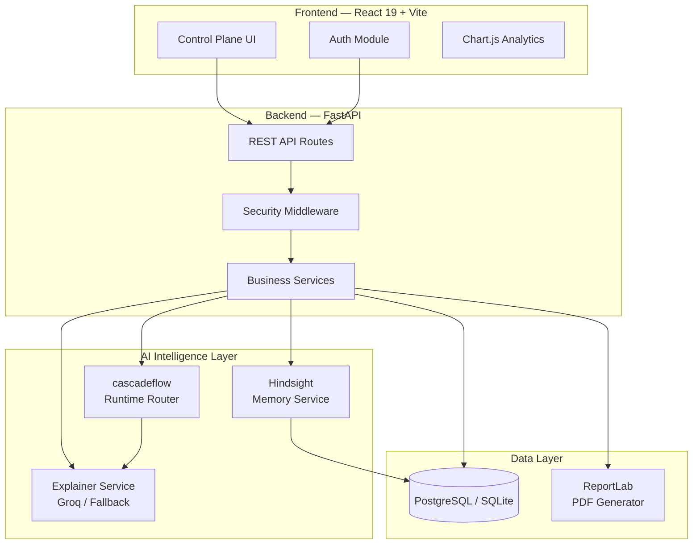
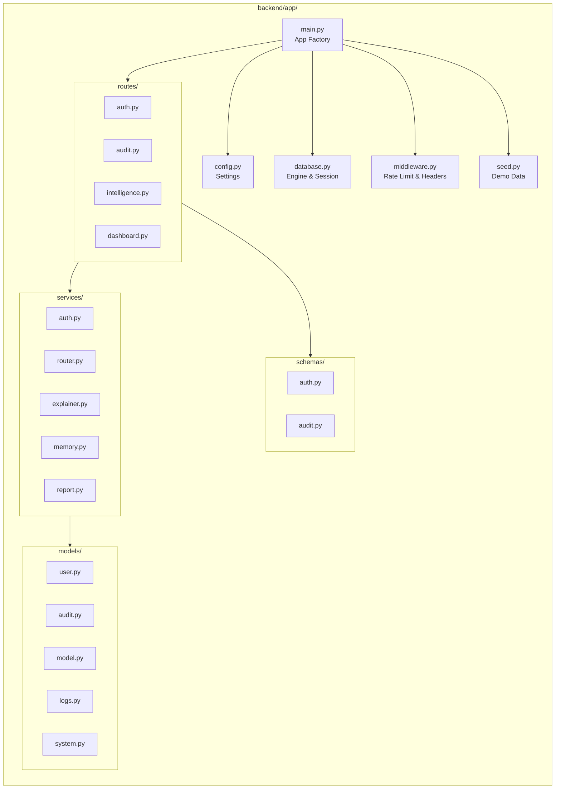
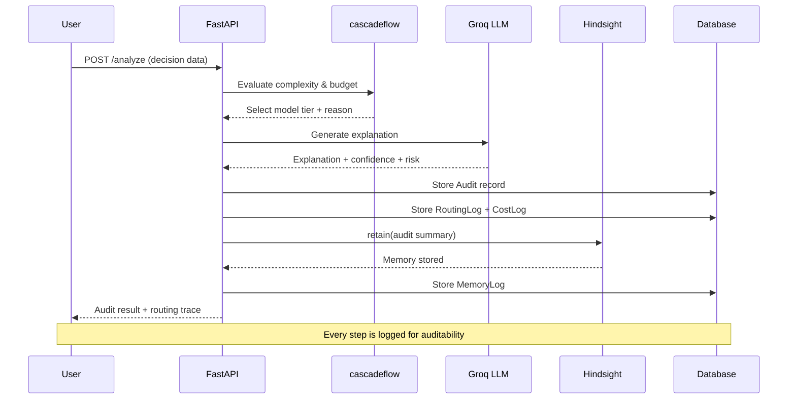
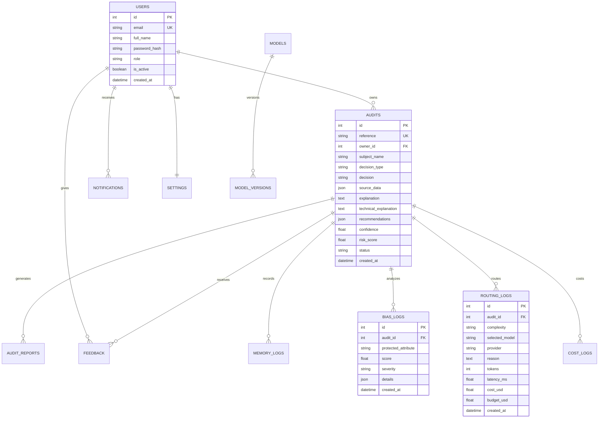

# AI Guardian — Architecture

> Enterprise decision-intelligence control plane for explaining, remembering, and governing AI outcomes.

## System Architecture

## Module Architecture

## Frontend Architecture

```mermaid
graph TB
    subgraph Frontend["frontend/src/"]
        app[App.tsx<br/>Shell & Router]

        subgraph Lib["lib/"]
            api[api.ts]
            types[types.ts]
            utils[utils.ts]
            hooks[hooks.ts]
            chart[chartConfig.ts]
        end

        subgraph Components["components/"]
            sidebar[Sidebar]
            header[Header]
            badge[Badge]
            stat[Stat]
            score[Score]
            skeleton[Skeleton]
            table[DataTable]
        end

        subgraph Pages["pages/"]
            auth_p[Auth]
            dash_p[Dashboard]
            new_p[NewAudit]
            hist_p[History]
            mem_p[Memory]
            fair_p[Fairness]
            drift_p[Drift]
            route_p[Routing]
            anal_p[Analytics]
            rep_p[Reports]
            set_p[Settings]
        end
    end

    app --> Lib
    app --> Pages
    Pages --> Components
    Pages --> Lib
    Components --> Lib
```

## AI Decision Workflow

## Database Schema

## Technology Stack

| Layer | Technology | Purpose |
|-------|-----------|---------|
| Frontend | React 19 | UI framework |
| Bundler | Vite | Build tool |
| Styling | Tailwind CSS 4 | Utility-first CSS |
| Animation | Framer Motion | Page transitions & micro-animations |
| Charts | Chart.js + react-chartjs-2 | Analytics visualizations |
| Icons | Lucide React | Consistent icon set |
| Forms | React Hook Form | Form validation |
| HTTP | Axios | API communication |
| Backend | FastAPI | REST API framework |
| ORM | SQLAlchemy 2.0 | Database abstraction |
| Validation | Pydantic | Request/response schemas |
| Auth | python-jose (JWT) | Token-based auth |
| PDF | ReportLab | Audit report generation |
| AI | Groq API | LLM inference |
| Memory | Hindsight | Long-term audit memory |
| Routing | cascadeflow | Intelligent model routing |
| Database | PostgreSQL / SQLite | Data persistence |
